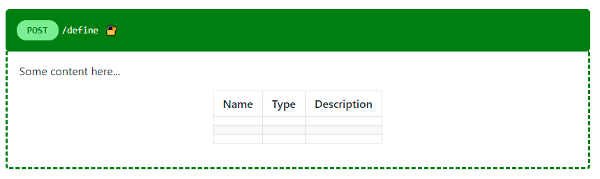
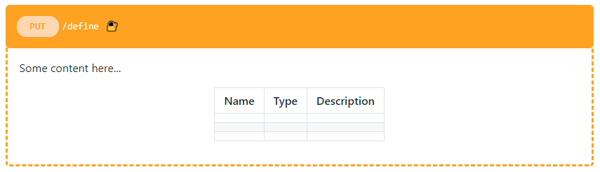
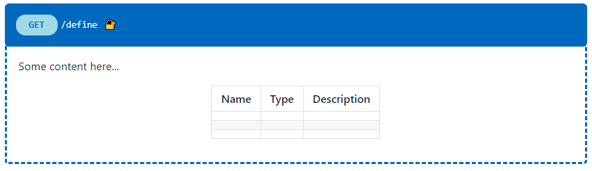
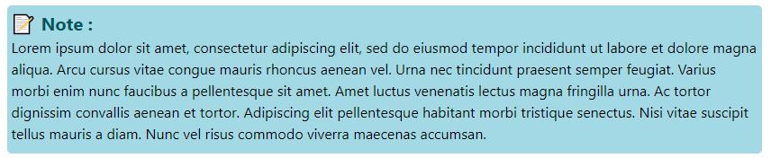
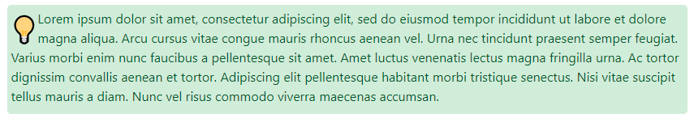
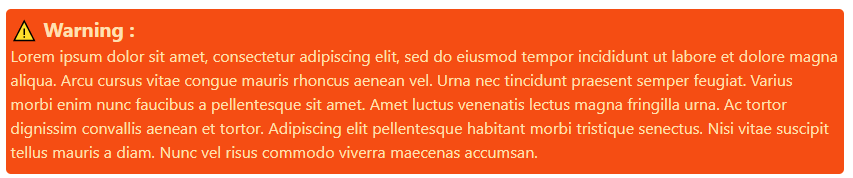

# 📚 Markdown cheatsheet <!-- omit in TOC -->

- [📈 API documentation using markdown](#-api-documentation-using-markdown)
  - [POST](#post)
  - [PUT](#put)
  - [GET](#get)
  - [DELETE](#delete)
- [📝 Markdown note](#-markdown-note)
  - [note](#note)
  - [tips](#tips)
  - [warning](#warning)
- [📛 Badge](#-badge)
  - [badgen](#badgen)
  - [shield.io](#shieldio)
  - [forthebadge](#forthebadge)
- [😃 Markdown emojis](#-markdown-emojis)
  - [Wich emojis to use for commit ?](#wich-emojis-to-use-for-commit-)
  - [Emojis Integrations](#emojis-integrations)
- [📊 Mermaid](#-mermaid)
  - [Examples](#examples)
    - [Flowchart](#flowchart)
    - [Sequence diagram](#sequence-diagram)
    - [Gantt chart](#gantt-chart)
    - [Class diagram](#class-diagram)
    - [State diagram](#state-diagram)
    - [Pie chart](#pie-chart)
- [✒️ Basic markdwown synthaxe](#️-basic-markdwown-synthaxe)

<br>

## 📈 API documentation using markdown

Recently I search how to write API documentation using markdown file and I find an awesome project here :

<div align="center">


</div>

* https://github.com/rigwild/apidoc-markdown

This project uses apiDoc to work, basically that's allow you to generate automatrically your API documentation using comment inside your code following a certain synthaxe
* [[apiDoc - github]](https://github.com/apidoc/apidoc)
* [[apiDoc - documentation]](https://apidocjs.com/)

By the way this project have also some converter in order to convert your apiDoc and all of them using [apidoc-core](https://github.com/apidoc/apidoc-core) internally :

|repo github|description|
|---|--|
|[apidoc-swagger](https://github.com/fsbahman/apidoc-swagger)|It uses apidoc to convert inline documentation comments into json schema and later convert it to swagger json schema.|
|[apidoc-swagger-3](https://github.com/amanoooo/apidoc-swagger-3)|It uses apidoc to convert inline documentation comments into json schema and later convert it to swagger json schema. (inspired by apidoc-swagger)|
|[gulp-apidoc-swagger](https://github.com/fsbahman/gulp-apidoc-swagger)|Swagger json schema generator via apidoc|
|[Docmaster](https://github.com/bonzzy/docmaster)|Docmaster exports Postman collection to Apidoc format|
|[apidoc-markdown](https://github.com/rigwild/apidoc-markdown)|apidoc-markdown uses apiDoc internally. To generate your Markdown documentation, using apiDoc comments inside your code.|

I find apidoc-markdown really awesome but the proposed template doesn't look that good so I was searching way to present API documentation in markdown. 

I wasn't able to find something really nice so I create some sample getting inspiration from swagger style documentation. In order to do this I use inline css directly inside html and markdown as the same time.

Like apidoc-markdown use EJS template file in reality you can create awesome template with that like you can use javascript synthaxe inside your template to add logic. In futur, I will certainly create a template for apidoc-markdown but for the moment I just create some reflexion sample : 

**That's will work only if you use an extension like markdown-viewer or if you read the markdown file using visual studio code**

<div align="center">

|visual studio code extension|markdown viewer extension|
|---|---|
|<div align="center">[](https://github.com/mjbvz/vscode-github-markdown-preview-style)</div><ul><li>[Github](https://github.com/mjbvz/vscode-github-markdown-preview-style)</li><li>[visual studio marketplace](https://marketplace.visualstudio.com/items?itemName=bierner.markdown-preview-github-styles)</li></ul>|<div align="center">[](https://github.com/simov/markdown-viewer)</div></li><ul><li>[Chrome](https://chrome.google.com/webstore/detail/markdown-viewer/ckkdlimhmcjmikdlpkmbgfkaikojcbjk)</li><li>[Firefox](https://addons.mozilla.org/en-US/firefox/addon/markdown-viewer-chrome/)</li><li>[Opera](https://addons.opera.com/en/extensions/details/install-chrome-extensions/)</li><li>[Edge](https://microsoftedge.microsoft.com/addons/detail/markdown-viewer/cgfmehpekedojlmjepoimbfcafopimdg)</li></ul>|

</div>

* Post not extended :


* Post extended :
  



### POST

|Not extended|Extended|
|---|---|
|||


<details>
<summary>result</summary>

<details>
<summary style="color:transparent;">
<pre class="notranslate" style="background-color:green; color: white;display:flex; flex-direction: row;">            
<div style="padding:5px; background-color:lightgreen;width:60px; border-radius:1em; align-items: center; text-align:center; font-weight:900; color:green;"> POST </div>
<div style="padding:5px;">/define</div>
<div style="padding:5px;  ">🔐</div>
</pre></summary>

<div style="border:dashed green; border-radius: 0px 0px 5px 5px; border-top:transparent; position:relative; top: -17px; background-color: transparence; padding: 17px 17px 17px 17px">

Some content here...

<div align="center">

|Name|Type|Description|
|---|---|---|
||||
||||
||||

</div>

</details>

</details>

<details>
<summary>POST code</summary>

```html

<details>
    <summary style="color:transparent;">
        <pre class="notranslate" style="background-color:green; color: white;display:flex; flex-direction: row;">            
        <div style="padding:5px; background-color:lightgreen;width:60px; border-radius:1em; align-items: center; text-align:center; font-weight:900; color:green;"> POST </div>
        <div style="padding:5px;">/define</div>
        <div style="padding:5px;  ">🔐</div>
</pre></summary>

<div style="border:dashed green; border-radius: 0px 0px 5px 5px; border-top:transparent; position:relative; top: -17px; background-color: transparence; padding: 17px 17px 17px 17px">

Some content here...

<div align="center">

|Name|Type|Description|
|---|---|---|
||||
||||
||||

</div>

</details>
```

</details>

<br>


### PUT

|Not extended|Extended|
|---|---|
|||

<details>
<summary>result</summary>

<details>
    <summary style="color:transparent;">
        <pre class="notranslate" style="background-color:orange; color: white;display:flex; flex-direction: row;">            
        <div style="padding:5px; background-color:#fed8b1;width:60px; border-radius:1em; align-items: center; text-align:center; font-weight:900; color:orange;"> PUT </div>
        <div style="padding:5px;">/define</div>
        <div style="padding:5px;  ">🔐</div>
</pre></summary>

<div style="border:dashed orange; border-radius: 0px 0px 5px 5px; border-top:transparent; position:relative; top: -17px; background-color: transparence; padding: 17px 17px 17px 17px">

Some content here...

<div align="center">

|Name|Type|Description|
|---|---|---|
||||
||||
||||

</div>

</details>

</details>


<details>
<summary>PUT code</summary>

```html

<details>
    <summary style="color:transparent;">
        <pre class="notranslate" style="background-color:orange; color: white;display:flex; flex-direction: row;">            
        <div style="padding:5px; background-color:#fed8b1;width:60px; border-radius:1em; align-items: center; text-align:center; font-weight:900; color:orange;"> PUT </div>
        <div style="padding:5px;">/define</div>
        <div style="padding:5px;  ">🔐</div>
</pre></summary>

<div style="border:dashed orange; border-radius: 0px 0px 5px 5px; border-top:transparent; position:relative; top: -17px; background-color: transparence; padding: 17px 17px 17px 17px">

Some content here...

<div align="center">

|Name|Type|Description|
|---|---|---|
||||
||||
||||

</div>

</details>
```

</details>

<br>

### GET

|Not extended|Extended|
|---|---|
|||


<details>
<summary>result</summary>

<details>
    <summary style="color:transparent;">
        <pre class="notranslate" style="background-color:#1565c0; color: white;display:flex; flex-direction: row;">            
        <div style="padding:5px; background-color:lightblue;width:60px; border-radius:1em; align-items: center; text-align:center; font-weight:900; color:#1565c0;"> GET </div>
        <div style="padding:5px;">/define</div>
        <div style="padding:5px;  ">🔐</div>
</pre></summary>

<div style="border:dashed #1565c0; border-radius: 0px 0px 5px 5px; border-top:transparent; position:relative; top: -17px; background-color: transparence; padding: 17px 17px 17px 17px">

Some content here...

<div align="center">

|Name|Type|Description|
|---|---|---|
||||
||||
||||

</div>

</details>

</details>

<details>
<summary>GET code</summary>

```html

<details>
    <summary style="color:transparent;">
        <pre class="notranslate" style="background-color:#1565c0; color: white;display:flex; flex-direction: row;">            
        <div style="padding:5px; background-color:lightblue;width:60px; border-radius:1em; align-items: center; text-align:center; font-weight:900; color:#1565c0;"> GET </div>
        <div style="padding:5px;">/define</div>
        <div style="padding:5px;  ">🔐</div>
</pre></summary>

<div style="border:dashed #1565c0; border-radius: 0px 0px 5px 5px; border-top:transparent; position:relative; top: -17px; background-color: transparence; padding: 17px 17px 17px 17px">

Some content here...

<div align="center">

|Name|Type|Description|
|---|---|---|
||||
||||
||||

</div>

</details>
```

</details>

<br>

### DELETE

|Not extended|Extended|
|---|---|
|||

<details>
<summary>result</summary>

<details>
    <summary style="color:transparent;">
        <pre class="notranslate" style="background-color:red; color: white;display:flex; flex-direction: row;">            
        <div style="padding:5px; background-color:#f2bbc5;width:60px; border-radius:1em; align-items: center; text-align:center; font-weight:900; color:red;"> DELETE </div>
        <div style="padding:5px;">/define</div>
        <div style="padding:5px;  ">🔐</div>
</pre></summary>

<div style="border:dashed red; border-radius: 0px 0px 5px 5px; border-top:transparent; position:relative; top: -17px; background-color: transparence; padding: 17px 17px 17px 17px">

Some content here...

<div align="center">

|Name|Type|Description|
|---|---|---|
||||
||||
||||

</div>

</details>

</details>

<details>
<summary>DELETE code</summary>

```html

<details>
    <summary style="color:transparent;">
        <pre class="notranslate" style="background-color:red; color: white;display:flex; flex-direction: row;">            
        <div style="padding:5px; background-color:#f2bbc5;width:60px; border-radius:1em; align-items: center; text-align:center; font-weight:900; color:red;"> DELETE </div>
        <div style="padding:5px;">/define</div>
        <div style="padding:5px;  ">🔐</div>
</pre></summary>

<div style="border:dashed red; border-radius: 0px 0px 5px 5px; border-top:transparent; position:relative; top: -17px; background-color: transparence; padding: 17px 17px 17px 17px">

Some content here...

<div align="center">

|Name|Type|Description|
|---|---|---|
||||
||||
||||

</div>

</details>
```

</details>


<br>
<br>

___

## 📝 Markdown note

It's also possible to use html inside markdown in order to enhance the readability of your document, here it's few example : 

**That's will work only if you use an extension like markdown-viewer or if you read the markdown file using visual studio code**

### note


<details>
<summary>result</summary>

<div style="color:black; background:lightblue; padding:5px; padding-bottom:10px ; border-radius:5px;">
<div style="font-size:200%; float:left;">📝</div>
<div>
Lorem ipsum dolor sit amet, consectetur adipiscing elit, sed do eiusmod tempor incididunt ut labore et dolore magna aliqua. Arcu cursus vitae congue mauris rhoncus aenean vel. Urna nec tincidunt praesent semper feugiat. Varius morbi enim nunc faucibus a pellentesque sit amet. Amet luctus venenatis lectus magna fringilla urna. Ac tortor dignissim convallis aenean et tortor. Adipiscing elit pellentesque habitant morbi tristique senectus. Nisi vitae suscipit tellus mauris a diam. Nunc vel risus commodo viverra maecenas accumsan.
</div>
</div>

</details>

<details>
<summary>code</summary>

```
<div style="color:black; background:lightblue; padding:5px; padding-bottom:10px ; border-radius:5px;">
<div style="font-size:200%; float:left;">📝</div>
<div>
Lorem ipsum dolor sit amet, consectetur adipiscing elit, sed do eiusmod tempor incididunt ut labore et dolore magna aliqua. Arcu cursus vitae congue mauris rhoncus aenean vel. Urna nec tincidunt praesent semper feugiat. Varius morbi enim nunc faucibus a pellentesque sit amet. Amet luctus venenatis lectus magna fringilla urna. Ac tortor dignissim convallis aenean et tortor. Adipiscing elit pellentesque habitant morbi tristique senectus. Nisi vitae suscipit tellus mauris a diam. Nunc vel risus commodo viverra maecenas accumsan.
</div>
</div>
```

</details>

<br>



<details>
<summary>result</summary>

<div style="display:flex; color:black; background:lightblue; padding:5px; padding-bottom:10px ; border-radius:5px; flex-direction: column;">
<div style="font-size:125%; float:left; align-items: center; text-align:left; font-weight:700; color: #0C5460">📝 Note : </div>
<div>
Lorem ipsum dolor sit amet, consectetur adipiscing elit, sed do eiusmod tempor incididunt ut labore et dolore magna aliqua. Arcu cursus vitae congue mauris rhoncus aenean vel. Urna nec tincidunt praesent semper feugiat. Varius morbi enim nunc faucibus a pellentesque sit amet. Amet luctus venenatis lectus magna fringilla urna. Ac tortor dignissim convallis aenean et tortor. Adipiscing elit pellentesque habitant morbi tristique senectus. Nisi vitae suscipit tellus mauris a diam. Nunc vel risus commodo viverra maecenas accumsan.
</div>
</div>

</details>

<details>
<summary>code</summary>

```
<div style="display:flex; color:black; background:lightblue; padding:5px; padding-bottom:10px ; border-radius:5px; flex-direction: column;">
<div style="font-size:125%; float:left; align-items: center; text-align:left; font-weight:700; color: #0C5460">📝 Note : </div>
<div>
Lorem ipsum dolor sit amet, consectetur adipiscing elit, sed do eiusmod tempor incididunt ut labore et dolore magna aliqua. Arcu cursus vitae congue mauris rhoncus aenean vel. Urna nec tincidunt praesent semper feugiat. Varius morbi enim nunc faucibus a pellentesque sit amet. Amet luctus venenatis lectus magna fringilla urna. Ac tortor dignissim convallis aenean et tortor. Adipiscing elit pellentesque habitant morbi tristique senectus. Nisi vitae suscipit tellus mauris a diam. Nunc vel risus commodo viverra maecenas accumsan.
</div>
</div>
```

</details>


<br>

### tips



<details>
<summary>result</summary>

<div style="background:#D4EDDA; padding:5px; padding-bottom:10px ; border-radius:5px; color: #155724">
<div style="font-size:200%; float:left; ">💡</div>
<div>
Lorem ipsum dolor sit amet, consectetur adipiscing elit, sed do eiusmod tempor incididunt ut labore et dolore magna aliqua. Arcu cursus vitae congue mauris rhoncus aenean vel. Urna nec tincidunt praesent semper feugiat. Varius morbi enim nunc faucibus a pellentesque sit amet. Amet luctus venenatis lectus magna fringilla urna. Ac tortor dignissim convallis aenean et tortor. Adipiscing elit pellentesque habitant morbi tristique senectus. Nisi vitae suscipit tellus mauris a diam. Nunc vel risus commodo viverra maecenas accumsan.
</div>
</div>

</details>


<details>
<summary>code</summary>

```
<div style="background:#D4EDDA; padding:5px; padding-bottom:10px ; border-radius:5px; color: #155724">
<div style="font-size:200%; float:left; ">💡</div>
<div>
Lorem ipsum dolor sit amet, consectetur adipiscing elit, sed do eiusmod tempor incididunt ut labore et dolore magna aliqua. Arcu cursus vitae congue mauris rhoncus aenean vel. Urna nec tincidunt praesent semper feugiat. Varius morbi enim nunc faucibus a pellentesque sit amet. Amet luctus venenatis lectus magna fringilla urna. Ac tortor dignissim convallis aenean et tortor. Adipiscing elit pellentesque habitant morbi tristique senectus. Nisi vitae suscipit tellus mauris a diam. Nunc vel risus commodo viverra maecenas accumsan.
</div>
</div>
```

</details>

<br>


<details>
<summary>result</summary>

<div style="display:flex; background:#D4EDDA; padding:5px; padding-bottom:10px ; border-radius:5px; flex-direction: column; color: #155724">
<div style="font-size:125%; float:left; align-items: center; text-align:left; font-weight:700; color: #155724">💡 Tip : </div>

<div>
Lorem ipsum dolor sit amet, consectetur adipiscing elit, sed do eiusmod tempor incididunt ut labore et dolore magna aliqua. Arcu cursus vitae congue mauris rhoncus aenean vel. Urna nec tincidunt praesent semper feugiat. Varius morbi enim nunc faucibus a pellentesque sit amet. Amet luctus venenatis lectus magna fringilla urna. Ac tortor dignissim convallis aenean et tortor. Adipiscing elit pellentesque habitant morbi tristique senectus. Nisi vitae suscipit tellus mauris a diam. Nunc vel risus commodo viverra maecenas accumsan.
</div>
</div>

</details>

<details>
<summary>code</summary>

```
<div style="display:flex; background:#D4EDDA; padding:5px; padding-bottom:10px ; border-radius:5px; flex-direction: column; color: #155724">
<div style="font-size:125%; float:left; align-items: center; text-align:left; font-weight:700; color: #155724">💡 Tip : </div>

<div>
Lorem ipsum dolor sit amet, consectetur adipiscing elit, sed do eiusmod tempor incididunt ut labore et dolore magna aliqua. Arcu cursus vitae congue mauris rhoncus aenean vel. Urna nec tincidunt praesent semper feugiat. Varius morbi enim nunc faucibus a pellentesque sit amet. Amet luctus venenatis lectus magna fringilla urna. Ac tortor dignissim convallis aenean et tortor. Adipiscing elit pellentesque habitant morbi tristique senectus. Nisi vitae suscipit tellus mauris a diam. Nunc vel risus commodo viverra maecenas accumsan.
</div>
</div>
```

</details>

<br>

### warning


<details>
<summary>result</summary>

<div style="background:#e65100; padding:5px; padding-bottom:10px ; border-radius:5px; color: #ffe0b2">
<div style="font-size:200%; float:left; ">⚠️</div>
<div>
Lorem ipsum dolor sit amet, consectetur adipiscing elit, sed do eiusmod tempor incididunt ut labore et dolore magna aliqua. Arcu cursus vitae congue mauris rhoncus aenean vel. Urna nec tincidunt praesent semper feugiat. Varius morbi enim nunc faucibus a pellentesque sit amet. Amet luctus venenatis lectus magna fringilla urna. Ac tortor dignissim convallis aenean et tortor. Adipiscing elit pellentesque habitant morbi tristique senectus. Nisi vitae suscipit tellus mauris a diam. Nunc vel risus commodo viverra maecenas accumsan.
</div>
</div>

</details>

<details>
<summary>code</summary>

```
<div style="background:#e65100; padding:5px; padding-bottom:10px ; border-radius:5px; color: #ffe0b2">
<div style="font-size:200%; float:left; ">⚠️</div>
<div>
Lorem ipsum dolor sit amet, consectetur adipiscing elit, sed do eiusmod tempor incididunt ut labore et dolore magna aliqua. Arcu cursus vitae congue mauris rhoncus aenean vel. Urna nec tincidunt praesent semper feugiat. Varius morbi enim nunc faucibus a pellentesque sit amet. Amet luctus venenatis lectus magna fringilla urna. Ac tortor dignissim convallis aenean et tortor. Adipiscing elit pellentesque habitant morbi tristique senectus. Nisi vitae suscipit tellus mauris a diam. Nunc vel risus commodo viverra maecenas accumsan.
</div>
</div>
```

</details>

<br>



<details>
<summary>result</summary>

<div style="display:flex; background:#e65100; padding:5px; padding-bottom:10px ; border-radius:5px; flex-direction: column; color: #ffe0b2">
<div style="font-size:125%; float:left; align-items: center; text-align:left; font-weight:700; color: #ffe0b2">⚠️ Warning : </div>

<div>
Lorem ipsum dolor sit amet, consectetur adipiscing elit, sed do eiusmod tempor incididunt ut labore et dolore magna aliqua. Arcu cursus vitae congue mauris rhoncus aenean vel. Urna nec tincidunt praesent semper feugiat. Varius morbi enim nunc faucibus a pellentesque sit amet. Amet luctus venenatis lectus magna fringilla urna. Ac tortor dignissim convallis aenean et tortor. Adipiscing elit pellentesque habitant morbi tristique senectus. Nisi vitae suscipit tellus mauris a diam. Nunc vel risus commodo viverra maecenas accumsan.
</div>
</div>

</details>

<details>
<summary>code</summary>

```
<div style="display:flex; background:#e65100; padding:5px; padding-bottom:10px ; border-radius:5px; flex-direction: column; color: #ffe0b2">
<div style="font-size:125%; float:left; align-items: center; text-align:left; font-weight:700; color: #ffe0b2">⚠️ Warning : </div>

<div>
Lorem ipsum dolor sit amet, consectetur adipiscing elit, sed do eiusmod tempor incididunt ut labore et dolore magna aliqua. Arcu cursus vitae congue mauris rhoncus aenean vel. Urna nec tincidunt praesent semper feugiat. Varius morbi enim nunc faucibus a pellentesque sit amet. Amet luctus venenatis lectus magna fringilla urna. Ac tortor dignissim convallis aenean et tortor. Adipiscing elit pellentesque habitant morbi tristique senectus. Nisi vitae suscipit tellus mauris a diam. Nunc vel risus commodo viverra maecenas accumsan.
</div>
</div>
```

</details>


<br>
<br>

___

## 📛 Badge

You may have seen some badges on famous repos while browsing github. Here is how you can add them on your own READMEs.md
* https://shields.io/
* https://badgen.net/
* https://forthebadge.com/

example : 

[](https://github.com/)  [](https://github.com/)
[](https://github.com/)
[](https://github.com/) 


### badgen

```
https://badgen.net/badge/:subject/:status/:color?icon=github
                   ──┬──  ───┬───  ──┬───  ──┬── ────┬──────
                     │       │       │       │       └─ Options (label, list, icon, color)
                     │       │       │       │
                     │      TEXT    TEXT    RGB / COLOR_NAME ( optional )
                     │
                  "badge" - default (static) badge generator
```

some example :

|badge|code|
|---|---|
||````|
||````|
||````|

<br>

### shield.io

```
https://img.shields.io/badge/:label-:message-:color?style=for-the-badge&logo=appveyor
                       ──┬──  ───┬─── ──┬───  ──┬── ────┬────────────────────────────
                         │       │      │       │       └─ Options (label, style, logo, color)
                         │       │      │       │
                         │      TEXT   TEXT    RGB / COLOR_NAME ( optional )
                         │
                  "badge" - default (static) badge generator
```

some example :

|badge|code|
|---|---|
||````|
||````|


<br>

### forthebadge

with forthebadge you can simply use a generator here : https://forthebadge.com/generator/

example : 

[](https://forthebadge.com)


<br>
<br>

____

## 😃 Markdown emojis 

For markdown emojis list you can find the list here :
* https://api.github.com/emojis 
* https://emojipedia.org/github/
* https://unicode.org/emoji/charts/full-emoji-list.html
* https://www.webfx.com/tools/emoji-cheat-sheet/
* https://github.com/yodamad/gitlab-emoji
* https://github.com/ikatyang/emoji-cheat-sheet/blob/master/README.md

Here again you can find an initiative trying to standardise the way to use emojis on github commit messages with gitmoji :

<div align="center">


</div>

* [github - gitmoji](https://github.com/carloscuesta/gitmoji)
* [gitmoji](https://gitmoji.dev/)
* [gitmoji - quick start article](https://engineeringfordatascience.com/posts/gitmoji/)
* https://github.com/dannyfritz/commit-message-emoji

<br>


### Wich emojis to use for commit ?

You can add emojis to any commit message by using the CLDR Short Name or unicode of the emoji in the commit message text.

For example :
```
 git commit -m ":bug: Fixed formatting error on home page" 
```
would render as :

🐛 Fixed formatting error on home page 

<br>

Here you can find a list of emoji that you can use for commit message : https://github.com/dannyfritz/commit-message-emoji

Commit Type | Emoji
----------  | -----
Initial Commit | [🎉 Party Popper](http://emojipedia.org/party-popper/)
Version Tag | [🔖 Bookmark](http://emojipedia.org/bookmark/)
New Feature | [✨ Sparkles](http://emojipedia.org/sparkles/)
Bugfix | [🐛 Bug](http://emojipedia.org/bug/)
Security Fix | [🔒 Lock](https://emojipedia.org/lock/)
Metadata | [📇 Card Index](http://emojipedia.org/card-index/)
Refactoring | [♻️ Black Universal Recycling Symbol](http://emojipedia.org/black-universal-recycling-symbol/)
Documentation | [📚 Books](http://emojipedia.org/books/)
Internationalization | [🌐 Globe With Meridians](http://emojipedia.org/globe-with-meridians/)
Accessibility | [♿ Wheelchair](https://emojipedia.org/wheelchair-symbol/)
Performance | [🐎 Horse](http://emojipedia.org/horse/)
Cosmetic | [🎨 Artist Palette](http://emojipedia.org/artist-palette/)
Tooling | [🔧 Wrench](http://emojipedia.org/wrench/)
Tests | [🚨 Police Cars Revolving Light](http://emojipedia.org/police-cars-revolving-light/)
Deprecation | [💩 Pile of Poo](http://emojipedia.org/pile-of-poo/)
Removal | [🗑️ Wastebasket](http://emojipedia.org/wastebasket/)
Work In Progress (WIP) | [🚧 Construction Sign](http://emojipedia.org/construction-sign/)

<br>

### Emojis Integrations

you can find a lot of way to use emoji here : https://github.com/dannyfritz/commit-message-emoji/blob/master/INTEGRATIONS.md 

|OS|emojis keyboard shortcut|
|---|---|
|OSX|``ctrl``+``⌘``+``space``|
|Windows| ``Win``+``.``|
|Ubuntu 20|``super``|
|Ubuntu all version| launch "Characters" application|

<br>
<br>

___

## 📊 Mermaid 

Mermaid is a synthax allowing you to create diagramm using text.
* https://github.com/mermaid-js/mermaid
* https://mermaid-js.github.io/mermaid-live-editor/
* https://github.com/mermaid-js/mermaid/blob/develop/docs/integrations.md
* https://mermaid-js.github.io/mermaid/#/


<div style="display:flex; color:black; background:lightblue; padding:5px; padding-bottom:10px ; border-radius:5px; flex-direction: column;">
<div style="font-size:125%; float:left; align-items: center; text-align:left; font-weight:700; color: #0C5460">📝 Note : </div>
<div>

Gitlab support mermaid synthax and Github recently add support for mermaid synthax : [2022-02-14 github article](https://github.blog/2022-02-14-include-diagrams-markdown-files-mermaid/)
</div>
</div>

<br>

### Examples

The following are some examples of the diagrams, charts and graphs that can be made using Mermaid. 

#### Flowchart 


```
flowchart LR

A[Hard] -->|Text| B(Round)
B --> C{Decision}
C -->|One| D[Result 1]
C -->|Two| E[Result 2]
```

<br>

#### Sequence diagram 


```
sequenceDiagram
Alice->>John: Hello John, how are you?
loop Healthcheck
    John->>John: Fight against hypochondria
end
Note right of John: Rational thoughts!
John-->>Alice: Great!
John->>Bob: How about you?
Bob-->>John: Jolly good!
```

<br>

#### Gantt chart 


```
gantt
    section Section
    Completed :done,    des1, 2014-01-06,2014-01-08
    Active        :active,  des2, 2014-01-07, 3d
    Parallel 1   :         des3, after des1, 1d
    Parallel 2   :         des4, after des1, 1d
    Parallel 3   :         des5, after des3, 1d
    Parallel 4   :         des6, after des4, 1d
```

<br>

#### Class diagram 


```
classDiagram
Class01 <|-- AveryLongClass : Cool
<<Interface>> Class01
Class09 --> C2 : Where am i?
Class09 --* C3
Class09 --|> Class07
Class07 : equals()
Class07 : Object[] elementData
Class01 : size()
Class01 : int chimp
Class01 : int gorilla
class Class10 {
  <<service>>
  int id
  size()
}
```

<br>

#### State diagram 


```
stateDiagram-v2
[*] --> Still
Still --> [*]
Still --> Moving
Moving --> Still
Moving --> Crash
Crash --> [*]
```

<br>

#### Pie chart 


```
pie
"Dogs" : 386
"Cats" : 85
"Rats" : 15
```

<br>
<br>

___

## ✒️ Basic markdwown synthaxe

* https://github.com/Kernix13/markdown-cheatsheet#back-to-top
* https://kernixwebdesign.com/website/code/markdown-cheat-sheet-beginners/
* https://github.com/luong-komorebi/Markdown-Tutorial
* https://www.w3schools.io/file/markdown-introduction/


